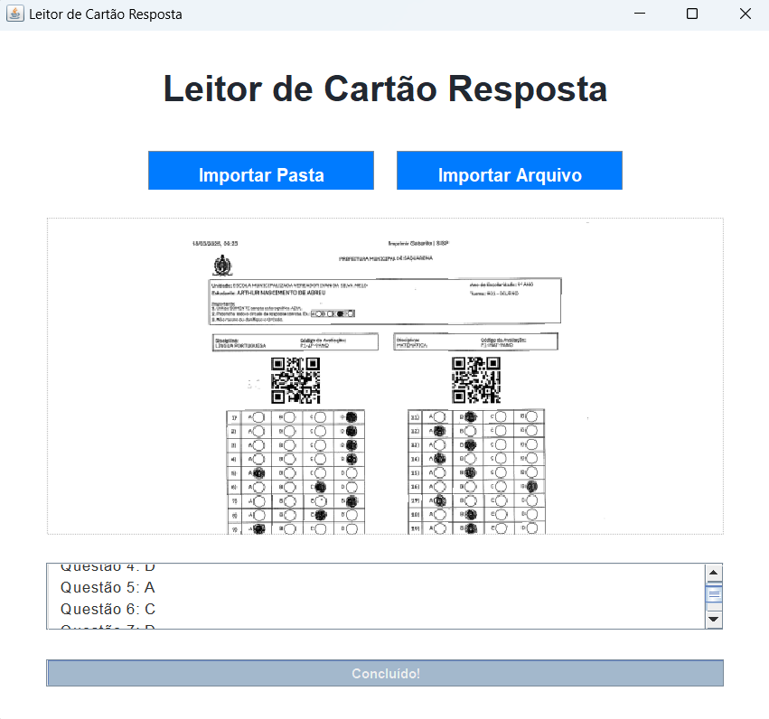

# Leitor_De_Cartao_Resposta

Aplicação desenvolvida em Java para automatizar a leitura e extração de informações de cartões-resposta usando OCR.
O sistema processa múltiplos arquivos de uma só vez, identifica dados como nome, turma e escola, reconhece alternativas marcadas e exporta os resultados para uma planilha Excel.

📌 Principais recursos:

Leitura automatizada via OpenCV e Tesseract

Exportação para Excel com Apache POI

Importação de uma pasta inteira de cartões

Interface gráfica em Swing com barra de progresso e pré-visualização

  

